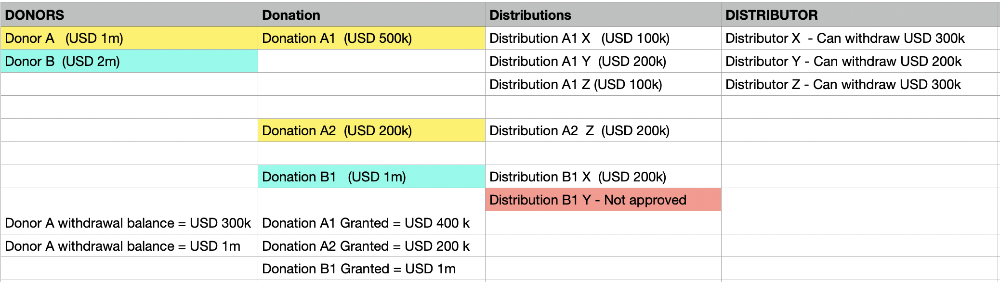

Donation Manager  
Sean Evans Consensys block chain developer bootcamp final project  
Nov 2021  
Ethereum address : evadev.eth  
email : robertseanevans@icloud.com  

In South Africa where I live the Covid pandemic has highlighted the need to easily and quickly distribute donor funds to worthy / trusted recipients as food tokens. Although a multi faceted problem this project will tackle some aspects of solving the problems using block chain technology. There are some simplifying assumptions.

Donation management concepts :
A = Donors        : Have funds available and want them to go to the needy  
B = Donations     : A portion of the donor funds with some metadata.  
                    A donors can make multiple donations  
C = Distributors  : Have on the ground connections with the needy (Also called NGO’s)  
D = Distributions : Links a donation to a list of recipients and can be allocated funds of successful  
                    A distributor can create multiple distributions  
                    A distribution can only come from one donation  

**Simplified workflow on the website**
1. Donors can
    1. register
    2. create a donation with the amount available for distribution, and how many USD per recipient per month they are willing to fund. $per recipient per month is a rough number since the contract runs int Eth. There is also gas and an admin fee% to pay the distributor for distrubting tokens to recipients.
    3. deposit funds into the donation manager contract under the donor's address
    4. approve or deny funds requested by a distributor once conditions are met
    5. get the donor's donation balances
    6. change the status of a distributor (To Trusted or UnTrusted).
    7. optionally withdraw any unused funds out of the donor's balance provided these are not earmarked for distribution
2. Distributors can
    1. register
    2. create a distribution against a donation that has been funded (i.e. not just created, it must have funds)
    3. request funding from the donation for a specific distribution. Provided certain conditions are met (eg the recipients file is valid)
    this distribution will move into status 'FundsRequested' to be approved or denied by the donor.
    4. withdraw funds from the distributor's balance  

**Directory structure**
/contracts :    Contains the Solidity source files for our smart contracts.  
/migrations :   scripts to migrate  
/frontEnd   :   contains the react fronnt end app  
/test/:         Contains Solidity tests for our smart contracts  
        dependency npm install --save-dev chai  
        dependency npm install --save-dev @openzeppelin/test-helpers  
        dependency npm install --save-dev @openzeppelin/test-environment  
        dependency npm install --save-dev mocha chai  
/node_modules/  contains the openzeppelin contracts  
        dependency npm install --save-dev @openzeppelin/contracts  
/Instructions : contains      avoiding_common_attacks.md & design_pattern_decisions.md    
Root Folder  
truffle-config.js: Truffle configuration file  
index.html  
package.json  
README.md  

**Run Instructions**
1. in one terminal window
    npx ganache-cli --deterministic
2. in a second terminal window
   truffle test

   to recompile all
   npx truffle compile --all
  (npx?) truffle compile && mocha --exit --recursive

**Dependencies**
These are the commands I ran for my project

npm init -y

node v16.13.0

npm install --save-dev truffle

npx truffle init

create contract /Contracts/DonationManager.sol
Update truffle-config for compiler version
create the deployment file /migrations/2_deploy_contracts.js

npm install --save-dev chai

npm install --save-dev @openzeppelin/test-helpers

npm install --save-dev @openzeppelin/test-environment

npm install --save-dev mocha chai

npm install --save-dev @openzeppelin/contracts

npm install -g truffle-expect truffle-config web3

npx truffle compile

Create the test file /test/DonationManager.test.js
For testing use Ganache set up on port 8545 network ID 1337
To run the tests run this :
truffle test — show-events

npx truffle migrate --network development

npm install -g truffle-abi     (For just generating ABI)

truffle-abi

npm install -g solc

create front end

npx http server  

**Simplifying assumptions:**
The basis of such a system is trust. This project will not definitively provide the ideal trust mechanisms necessary, but its worth describing them for completeness.

Donors need to trust that the lists of recipients are not bogus. As such a trust building mechanism could be added to this process in the form of either
1. Additional third parties (teachers, community leaders etc) that have to vet the recipient lists.
2. The NGO can only submit small lists of recipients initally; in other words the contract donation size for a new NGO is limited but can grow at a a given rate for each successful campaign completed (perhaps measured by redemption %)
3. The retailer could play a role in vetting that that the recipient that present themselves are indeed the intended recipients as per the NGO list

These additional trust mechanisms would be outside the scope of the project.
