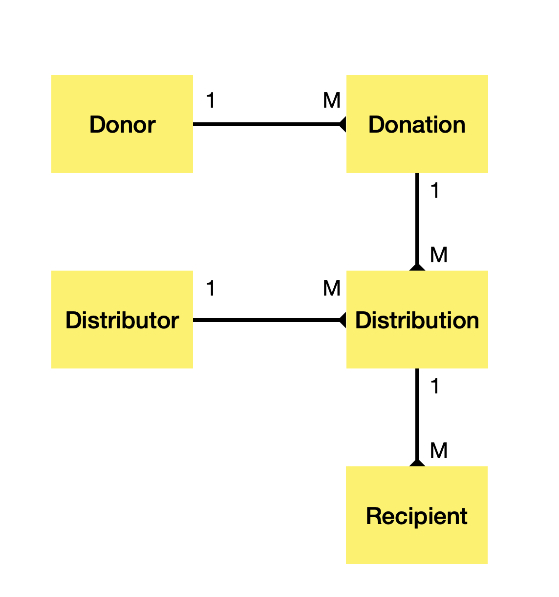

Sean Evans Consensys block chain developer bootcamp final project
Nov 2021
Ethereum address : evadev.eth
email : robertseanevans@icloud.com

**Design Pattern Decisions**

For simplicity I wanted to keep everything in a single contract but this may cause contract size limit issues.

**Access Control**
The main contract is ownable to allow the donation manager contract owner to pause the contract.
This is implemented inheriting from the openZeppelin Ownable.sol contract.

Within the contract different roles are created and these are enforced with function modifiers
- Donors  (eg can create & fund Donations, Approve funds to distributors)
- Distributors (eg can create distributions, request funds etc)

**Data model**
A key design decision are the data structures to support these relationships
 
